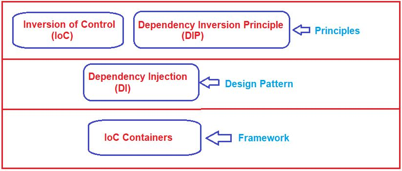

# Dependency Injection (DI)

## 📚 ¿Qué es?

**Dependency Injection** es la implementación más popular del patrón **IoC (Inversion of Control)**.

En lugar de que un objeto cree sus dependencias internamente, estas son **inyectadas** desde el exterior por un contenedor.

## ¿Por qué es una implementación de IoC?

- **Inversión del control**: El objeto ya no controla la creación de sus dependencias
- **Responsabilidad externa**: Un contenedor externo se encarga de crear e inyectar las dependencias
- **Desacoplamiento**: Los objetos solo definen qué necesitan, no cómo obtenerlo

##  Tipos de Inyección

**Constructor Injection** – Dependencias se pasan por el constructor (recomendado)

**Setter Injection** – Dependencias se inyectan via métodos setter

**Field Injection** – Dependencias se inyectan directamente en campos

## 🛠️ Frameworks que usan DI

### Java
- **Spring Framework** - El más popular para Java
- **Google Guice** - Framework ligero de DI
- **CDI (Contexts and Dependency Injection)** - Estándar Java EE
- **Dagger** - DI para Android y Java

### Otros lenguajes
- **Angular** (TypeScript) - Sistema DI integrado
- **.NET Core** (C#) - DI container nativo
- **Laravel** (PHP) - Service container

## Ventajas

- **Testabilidad**: Fácil crear mocks y stubs
- **Flexibilidad**: Cambiar implementaciones sin modificar código
- **Mantenibilidad**: Código más limpio y desacoplado
- **Reutilización**: Componentes más modulares

## Diferencias entre IoC y DI
