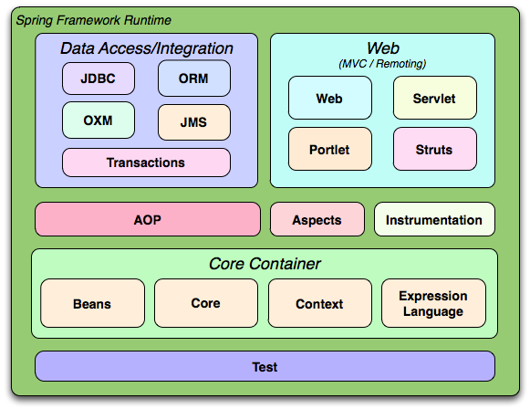

# Spring framework project and its features
## Cada característica del proyecto Spring Framework provee una funcionalidad específica que facilita el desarrollo de aplicaciones Java. A continuación, se describen algunas de las características más destacadas:
- **Inversión de Control (IoC)**: Permite la gestión de objetos y sus dependencias a través de un contenedor, facilitando la creación y configuración de componentes.
- **Programación Orientada a Aspectos (AOP)**: Permite la separación de preocupaciones transversales, como la gestión de transacciones y la seguridad, mediante la modularización del código.
- **Soporte para Transacciones**: Proporciona una gestión declarativa y programática de transacciones, facilitando la integración con diversas tecnologías de bases de datos.
- **Integración con Tecnologías Populares**: Ofrece soporte para diversas tecnologías como Hibernate, JPA, JMS, y más, facilitando la integración con otros frameworks y bibliotecas.
- **Desarrollo Web**: Incluye módulos como Spring MVC para la creación de aplicaciones web robustas y escalables.
- **Seguridad**: Proporciona un marco de trabajo para la autenticación y autorización de usuarios, mejorando la seguridad de las aplicaciones.
- **Testing**: Facilita la realización de pruebas unitarias e integradas mediante la integración con frameworks de pruebas como JUnit y TestNG.
- **Microservicios**: Soporta la creación de aplicaciones basadas en microservicios mediante Spring Boot y Spring Cloud, facilitando el desarrollo y despliegue de servicios independientes.
